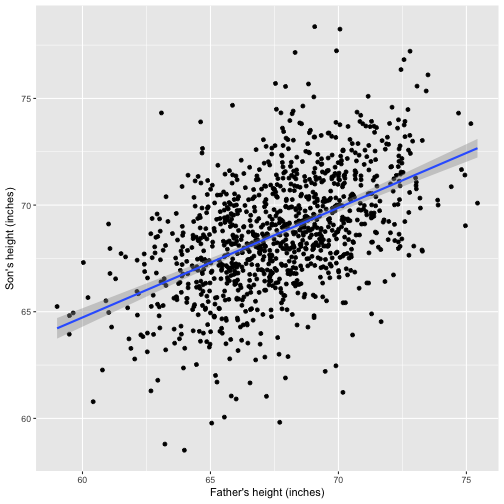

Predicting son's height with father's height
========================================================
author: Wonhee Lee
date: 12/07/2016
autosize: true

Introduction
========================================================

This presentation is part of the Course Project for the Coursera Developing Data Products class. The peer assessed assignment consists of two parts. 
- Create a Shiny application and deploy it on Rstudio's server. 
- Use Slidify or Rstudio Presenter to prepare a reproducible pitch presentation about the application.

This presentation adresses the second part of the course project.

Executive Summary
========================================================

The presentation consists of a visualization of a linear regression model that attempts to predict the son's height given the father's height according to data available in the "father.son" dataset in the UsingR package in R.

We have used the Shiny platform and the application of its reactive features in this analysis. The graphic will return the projected son's height given the father's height as an input.

Plot of the data & linear model
========================================================


```r
library(ggplot2)
library(UsingR)
data(father.son)
g <- ggplot(father.son, aes(x = fheight,y = sheight))
g + geom_point() + geom_smooth(method = "lm") + xlab("Father's height (inches)") + ylab("Son's height (inches)")
```



Links
========================================================

The URL for the shiny application is listed below:
https://wonheelee90.shinyapps.io/project/

The source code for ui.R and server.R files are available on github:
https://github.com/wonheelee90/Developing-Data-Products
